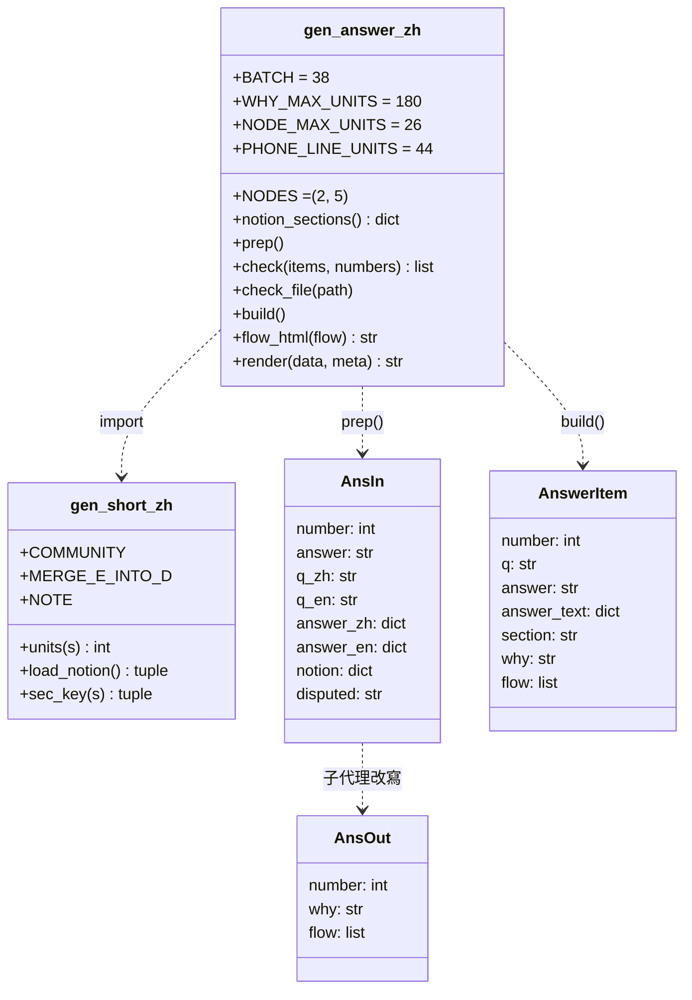
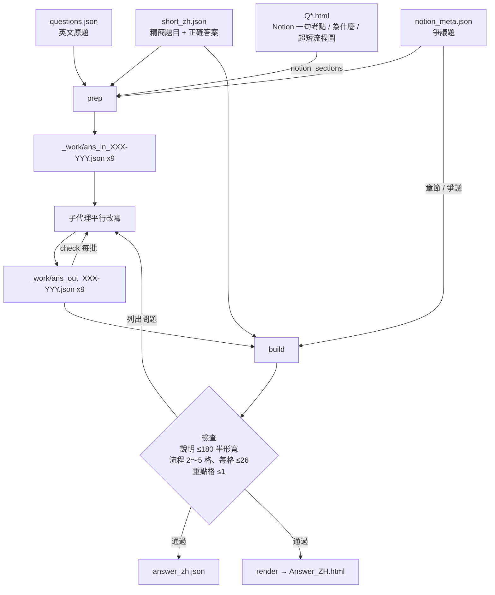
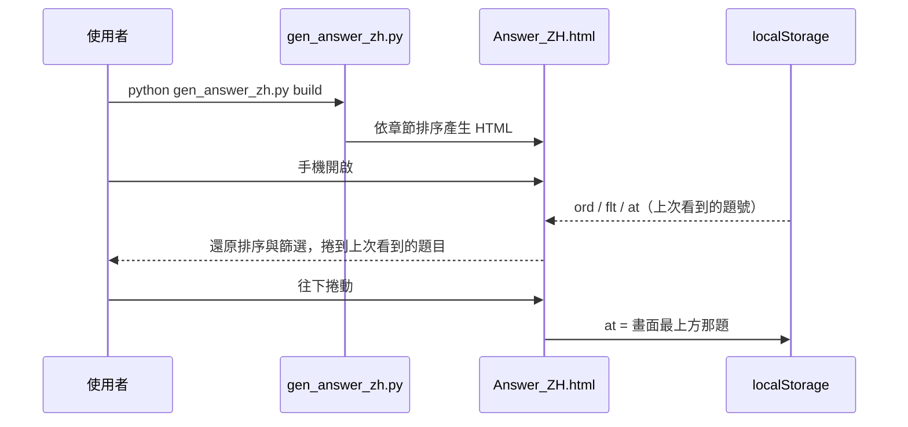
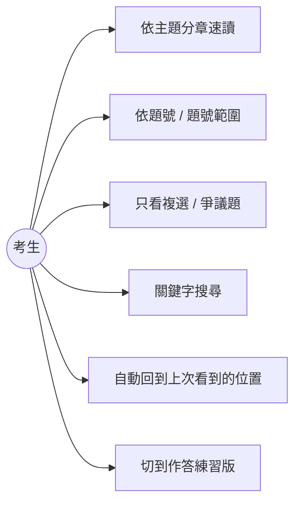
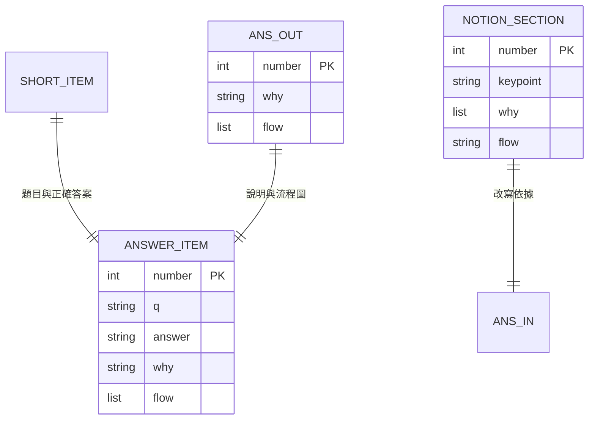

# gen_answer_zh.py - Mermaid 圖表

> 產生日期：2026-10-09｜DEA-C01 答案速讀版：只列題目、正確答案、5 行內說明與流程圖

## 類別圖（模組結構）

```mermaid
classDiagram
    class gen_answer_zh {
        +BATCH = 38
        +WHY_MAX_UNITS = 180
        +NODE_MAX_UNITS = 26
        +NODES = (2, 5)
        +PHONE_LINE_UNITS = 44
        +notion_sections() dict
        +prep()
        +check(items, numbers) list
        +check_file(path)
        +build()
        +flow_html(flow) str
        +render(data, meta) str
    }
    class gen_short_zh {
        +COMMUNITY
        +MERGE_E_INTO_D
        +NOTE
        +units(s) int
        +load_notion() tuple
        +sec_key(s) tuple
    }
    class AnsIn {
        number: int
        answer: str
        q_zh: str
        q_en: str
        answer_zh: dict
        answer_en: dict
        notion: dict
        disputed: str
    }
    class AnsOut {
        number: int
        why: str
        flow: list
    }
    class AnswerItem {
        number: int
        q: str
        answer: str
        answer_text: dict
        section: str
        why: str
        flow: list
    }
    gen_answer_zh ..> gen_short_zh : import
    gen_answer_zh ..> AnsIn : prep()
    AnsIn ..> AnsOut : 子代理改寫
    gen_answer_zh ..> AnswerItem : build()
```

## 流程圖

```mermaid
flowchart TD
    S[short_zh.json<br>精簡題目 + 正確答案] --> P[prep]
    Q[questions.json<br>英文原題] --> P
    H[Q*.html<br>Notion 一句考點 / 為什麼 / 超短流程圖] -->|notion_sections| P
    M[notion_meta.json<br>爭議題] --> P
    P --> I[_work/ans_in_XXX-YYY.json x9]
    I --> A[子代理平行改寫]
    A --> O[_work/ans_out_XXX-YYY.json x9]
    O -->|check 每批| A
    O --> B[build]
    S --> B
    M -->|章節 / 爭議| B
    B --> C{檢查<br>說明 ≤180 半形寬<br>流程 2～5 格、每格 ≤26<br>重點格 ≤1}
    C -->|列出問題| A
    C -->|通過| J[answer_zh.json]
    C -->|通過| K[render → Answer_ZH.html]
```

## 循序圖

```mermaid
sequenceDiagram
    participant U as 使用者
    participant S as gen_answer_zh.py
    participant H as Answer_ZH.html
    participant L as localStorage
    U->>S: python gen_answer_zh.py build
    S->>H: 依章節排序產生 HTML
    U->>H: 手機開啟
    L-->>H: ord / flt / at（上次看到的題號）
    H-->>U: 還原排序與篩選，捲到上次看到的題目
    U->>H: 往下捲動
    H->>L: at = 畫面最上方那題
```

## UseCase

```mermaid
flowchart LR
    U((考生))
    U --> UC0[依主題分章速讀]
    U --> UC1[依題號 / 題號範圍]
    U --> UC2[只看複選 / 爭議題]
    U --> UC3[關鍵字搜尋]
    U --> UC4[自動回到上次看到的位置]
    U --> UC5[切到作答練習版]
```

## 資料結構 ER Model

```mermaid
erDiagram
    SHORT_ITEM ||--|| ANSWER_ITEM : "題目與正確答案"
    ANS_OUT ||--|| ANSWER_ITEM : "說明與流程圖"
    NOTION_SECTION ||--|| ANS_IN : "改寫依據"
    ANSWER_ITEM {
        int number PK
        string q
        string answer
        string why
        list flow
    }
    ANS_OUT {
        int number PK
        string why
        list flow
    }
    NOTION_SECTION {
        int number PK
        string keypoint
        list why
        string flow
    }
```
