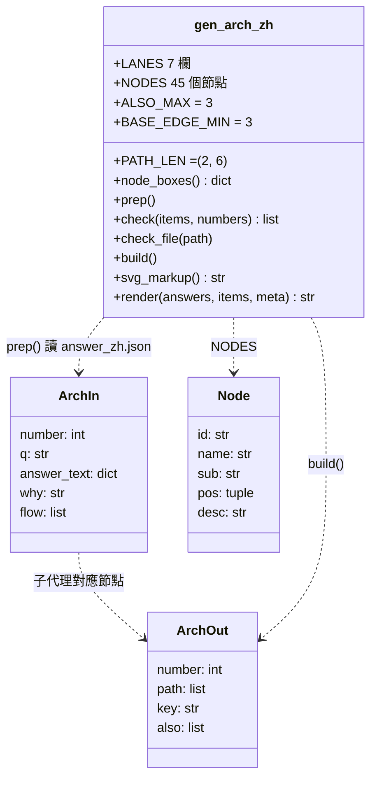
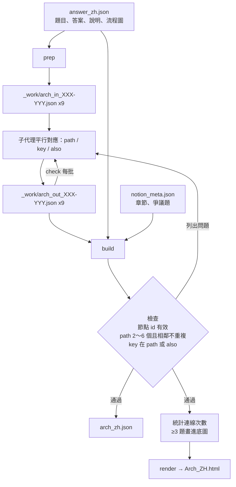
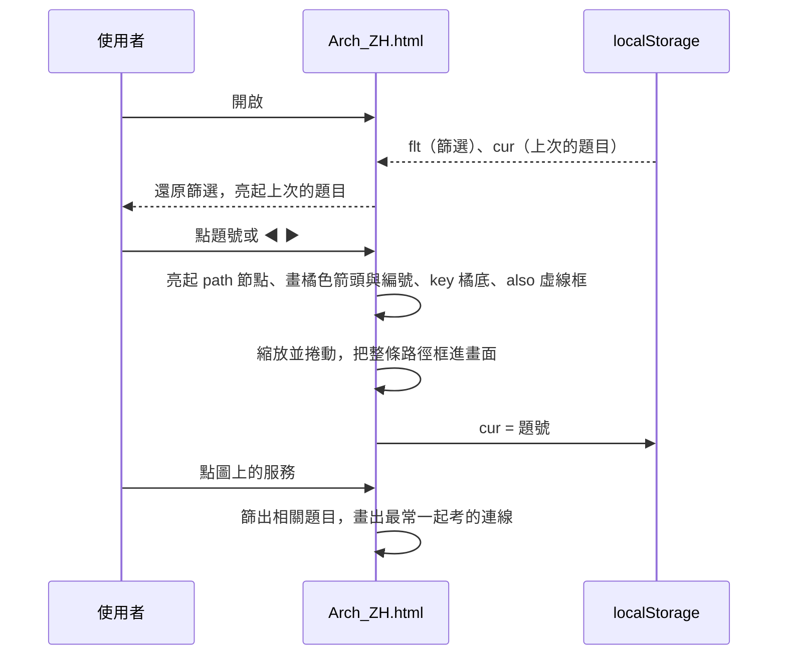
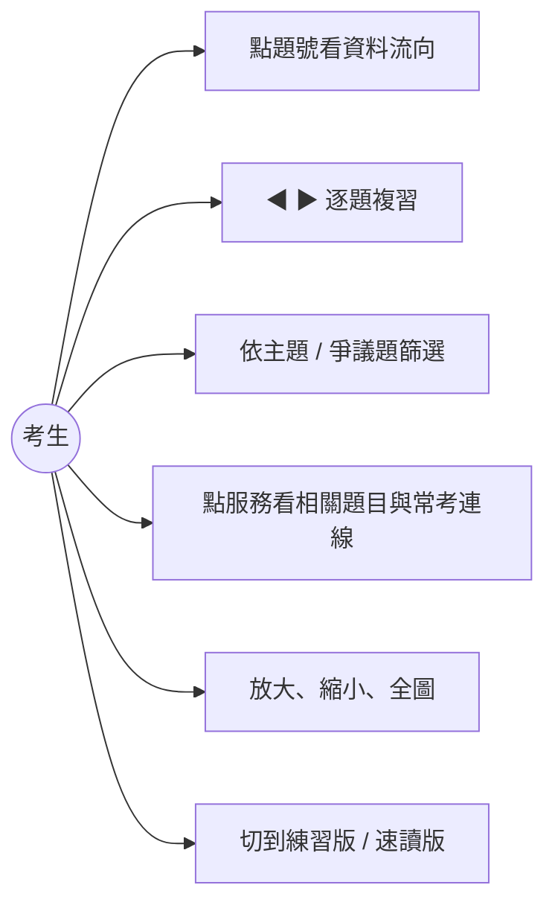
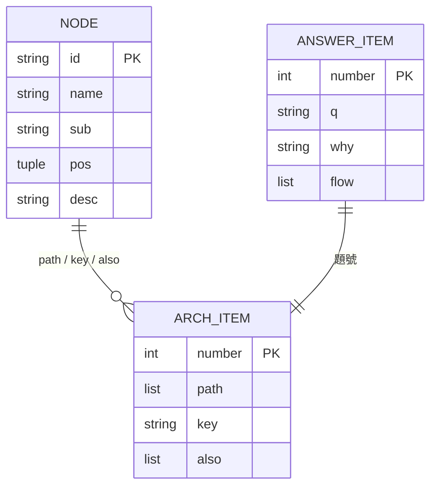

# gen_arch_zh.py - Mermaid 圖表

> 產生日期：2026-10-09｜DEA-C01 架構圖版：一張 AWS 資料架構總圖，點題號亮起該題用到的服務與資料流向

## 類別圖（模組結構）

```mermaid
classDiagram
    class gen_arch_zh {
        +LANES 7 欄
        +NODES 45 個節點
        +PATH_LEN = (2, 6)
        +ALSO_MAX = 3
        +BASE_EDGE_MIN = 3
        +node_boxes() dict
        +prep()
        +check(items, numbers) list
        +check_file(path)
        +build()
        +svg_markup() str
        +render(answers, items, meta) str
    }
    class ArchIn {
        number: int
        q: str
        answer_text: dict
        why: str
        flow: list
    }
    class ArchOut {
        number: int
        path: list
        key: str
        also: list
    }
    class Node {
        id: str
        name: str
        sub: str
        pos: tuple
        desc: str
    }
    gen_arch_zh ..> ArchIn : prep() 讀 answer_zh.json
    ArchIn ..> ArchOut : 子代理對應節點
    gen_arch_zh ..> Node : NODES
    gen_arch_zh ..> ArchOut : build()
```

## 流程圖

```mermaid
flowchart TD
    A[answer_zh.json<br>題目、答案、說明、流程圖] --> P[prep]
    P --> I[_work/arch_in_XXX-YYY.json x9]
    I --> G[子代理平行對應：path / key / also]
    G --> O[_work/arch_out_XXX-YYY.json x9]
    O -->|check 每批| G
    O --> B[build]
    A --> B
    M[notion_meta.json<br>章節、爭議題] --> B
    B --> C{檢查<br>節點 id 有效<br>path 2～6 個且相鄰不重複<br>key 在 path 或 also}
    C -->|列出問題| G
    C -->|通過| J[arch_zh.json]
    C -->|通過| E[統計連線次數<br>≥3 題畫進底圖]
    E --> K[render → Arch_ZH.html]
```

## 循序圖

```mermaid
sequenceDiagram
    participant U as 使用者
    participant H as Arch_ZH.html
    participant L as localStorage
    U->>H: 開啟
    L-->>H: flt（篩選）、cur（上次的題目）
    H-->>U: 還原篩選，亮起上次的題目
    U->>H: 點題號或 ◀ ▶
    H->>H: 亮起 path 節點、畫橘色箭頭與編號、key 橘底、also 虛線框
    H->>H: 縮放並捲動，把整條路徑框進畫面
    H->>L: cur = 題號
    U->>H: 點圖上的服務
    H->>H: 篩出相關題目，畫出最常一起考的連線
```

## UseCase

```mermaid
flowchart LR
    U((考生))
    U --> UC0[點題號看資料流向]
    U --> UC1[◀ ▶ 逐題複習]
    U --> UC2[依主題 / 爭議題篩選]
    U --> UC3[點服務看相關題目與常考連線]
    U --> UC4[放大、縮小、全圖]
    U --> UC5[切到練習版 / 速讀版]
```

## 資料結構 ER Model

```mermaid
erDiagram
    NODE ||--o{ ARCH_ITEM : "path / key / also"
    ANSWER_ITEM ||--|| ARCH_ITEM : "題號"
    ARCH_ITEM {
        int number PK
        list path
        string key
        list also
    }
    NODE {
        string id PK
        string name
        string sub
        tuple pos
        string desc
    }
    ANSWER_ITEM {
        int number PK
        string q
        string why
        list flow
    }
```
