# AWS DEA-C01 HTML 產生器 v4 - Mermaid 圖表

> 產生日期：2026-08-06
> 結合 PDF 英文原文 + Notion 中文解析，產生含中英切換的 HTML

## 類別圖（Class Diagram）

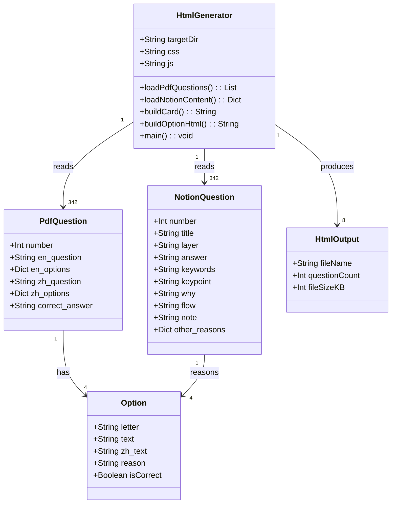

## 循序圖（Sequence Diagram）

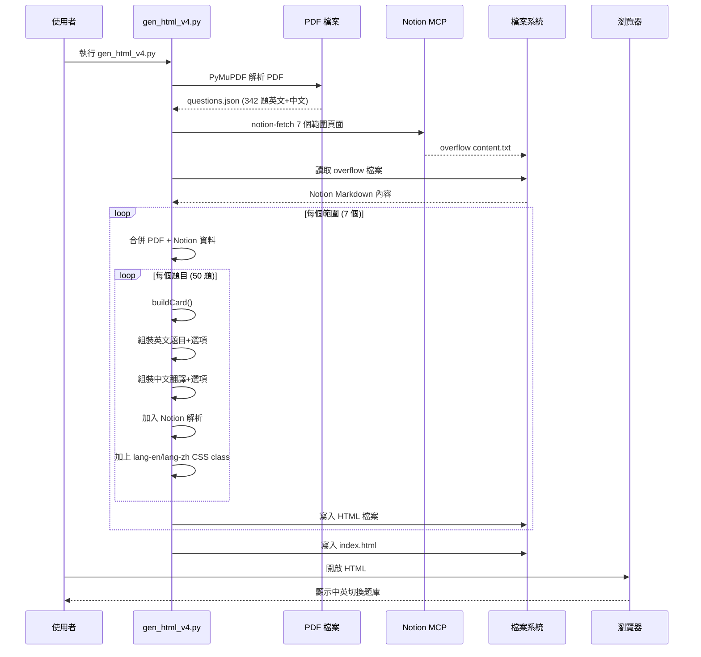

## 流程圖（Flowchart）

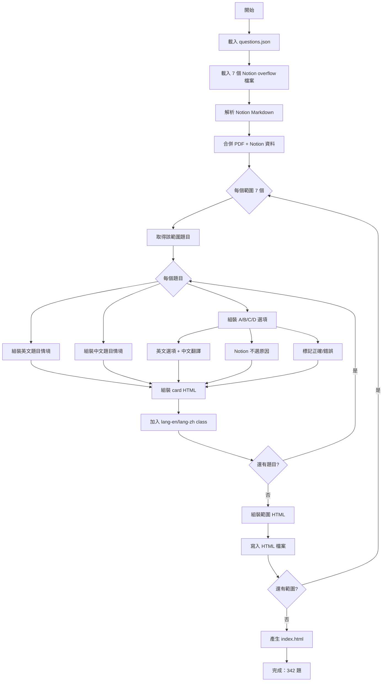

## UseCase 圖

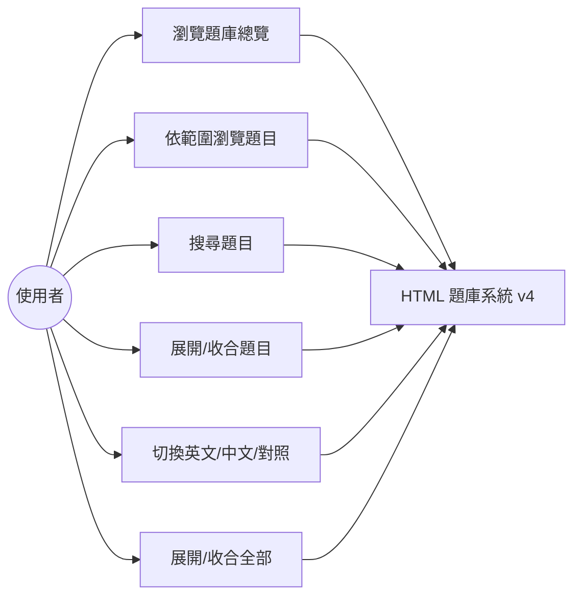

## 資料結構 ER Model

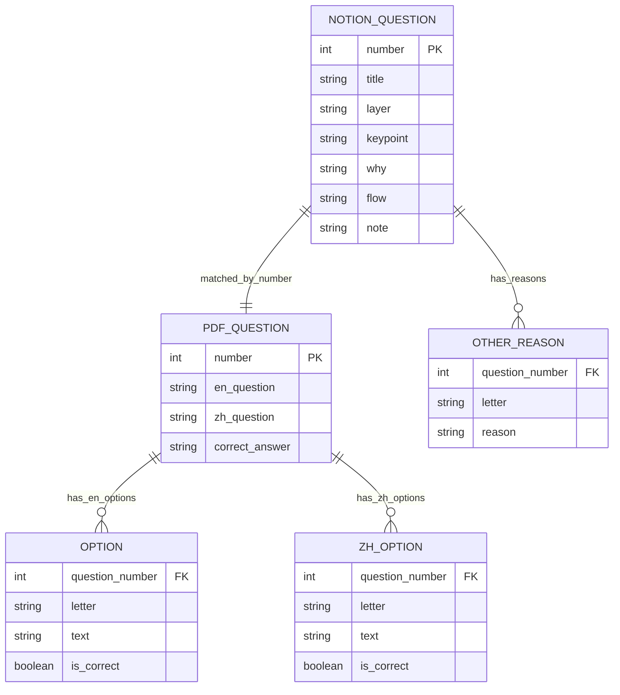

## 語言切換機制

`body` 的 class 決定顯示哪一種語言，內容元素則掛 `lang-en` / `lang-zh`。

> **重要**：body 的 class 必須用 `mode-*` 前綴，不能與內容的 `lang-*` 同名。
> 若 body 也叫 `lang-en`，`.lang-en{display:none}` 會直接把整個 body 隱藏，造成全白畫面。

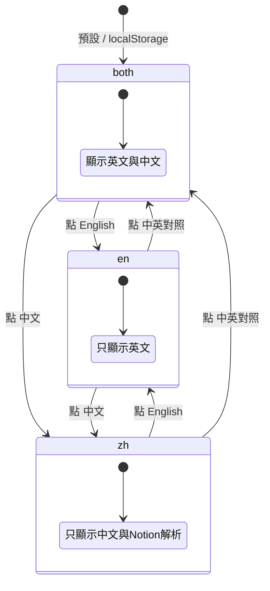

| body class | 顯示的內容 |
|------------|-----------|
| `mode-en` | `.lang-en`（英文題目、英文選項） |
| `mode-zh` | `.lang-zh`（中文題目、中文選項、不選原因、Notion 解析） |
| `mode-both` | 兩者皆顯示，中文以虛線分隔並淡化 |

對應 CSS：

```css
.lang-en,.lang-zh{display:none}
body.mode-en .lang-en{display:block}
body.mode-zh .lang-zh{display:block}
body.mode-both .lang-en,body.mode-both .lang-zh{display:block}
```

語言偏好以 `localStorage.dea-lang` 記憶，下次開啟自動套用。

## 關鍵字高亮機制（v4.1 新增）

題目展開後，最下方的 Keywords 標籤列中的關鍵字，會在題目情境和選項中被加粗 + 高亮。

### 運作流程

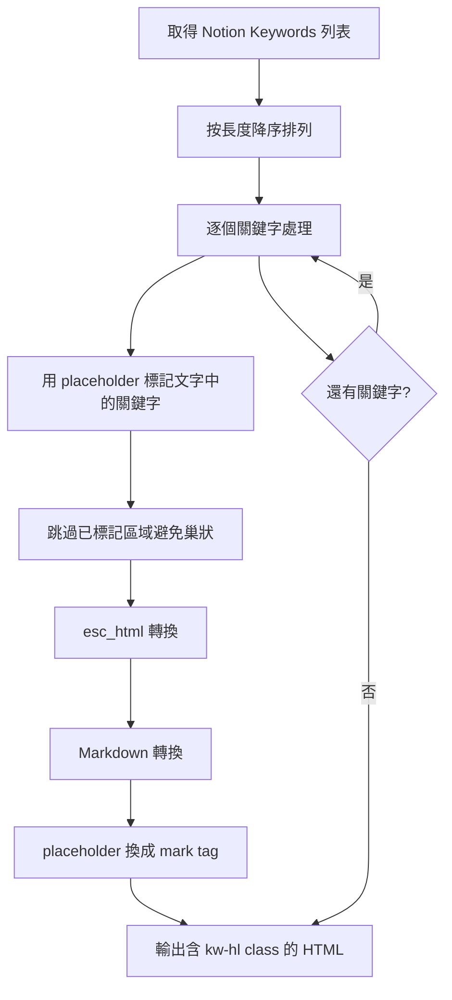

### CSS 切換

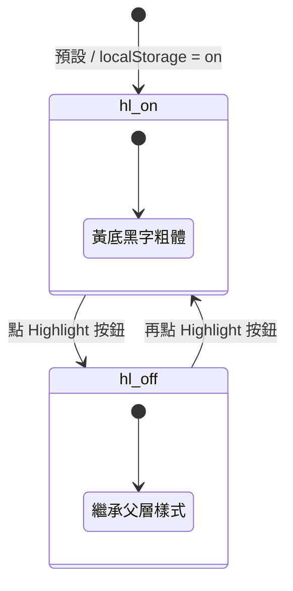

| body class | 高亮樣式 |
|------------|---------|
| （無 kw-off） | 黃底 `#fff59d`、黑字、粗體 600 |
| `kw-off` | 背景透明、文字正常、非粗體 |

### 關鍵字處理邏輯

| 步驟 | 說明 |
|------|------|
| 1. 過濾 | 只保留長度 ≥ 3 的關鍵字 |
| 2. 排序 | 按長度降序，避免短關鍵字破壞長關鍵字 |
| 3. 分段 | 用 regex 把已標記區域 `\x00...\x01` 分開 |
| 4. 替換 | 只在未標記段中做 case-insensitive 替換 |
| 5. 轉換 | esc_html → Markdown → placeholder 換成 `<mark>` |

## 手機版 topbar 瘦身（v4.2 新增）

原本 topbar 在 360×740 手機上佔 279px（38% 螢幕），加上瀏覽器網址列後幾乎佔掉一半。

### 優化前後對照

| 區塊 | 優化前 | 優化後 |
|------|--------|--------|
| 標題 h1 | 29px（18px 字） | 29px（15px 字，與下拉選單同排） |
| 搜尋框 | 39px 常駐 | 0px（改放大鏡圖示，點擊才展開） |
| 按鈕列 | 68px（2 排，英文長標籤） | 29px（1 排，EN/中/雙語/展開/收合/高亮） |
| 範圍導航 | 98px（8 個連結排 3 排） | 0px（改 `<select>` 下拉，併入標題排） |
| padding | 45px | 19px |
| **合計** | **279px（38%）** | **77px（10%）** |
| **可視區** | 461px | **663px（+44%）** |

再加上捲動自動隱藏，往下看題目時 topbar 完全消失，可視區達 100%。

### 版面結構

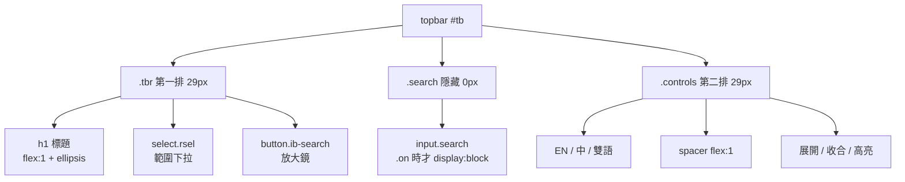

### 捲動自動隱藏狀態機

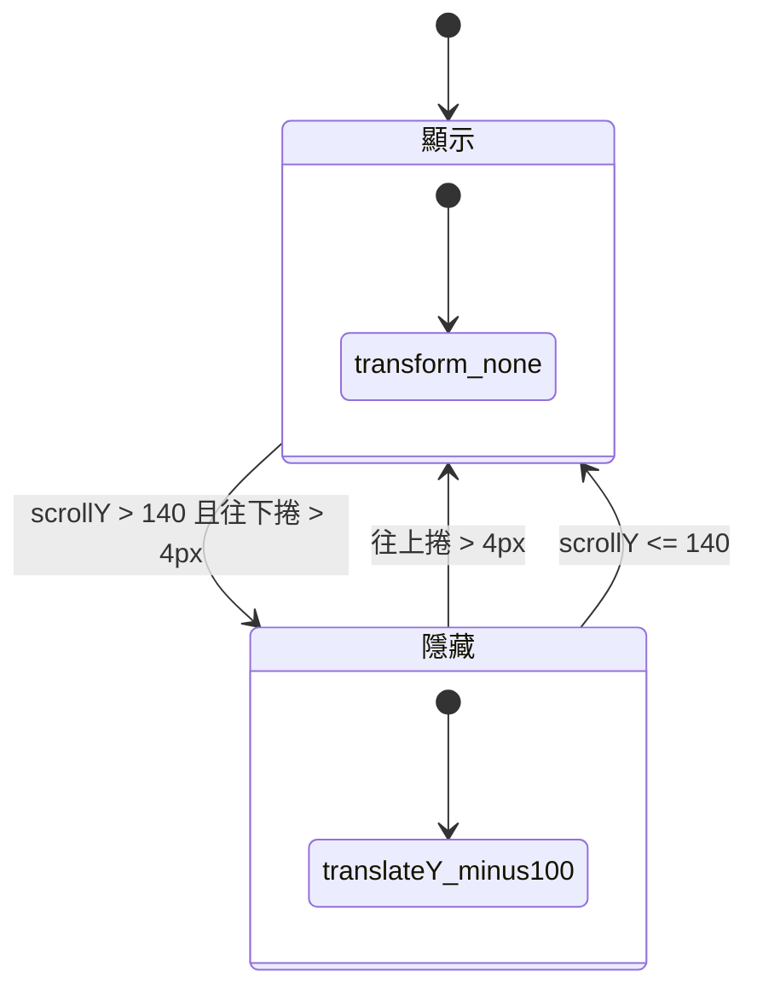

實作重點：

| 項目 | 說明 |
|------|------|
| 觸發門檻 | `scrollY > 140` 才開始隱藏，避免頂端抖動 |
| 遲滯 | 位移需 > 4px 才動作，避免慣性捲動時閃爍 |
| 動畫 | `transform:translateY(-100%)` + `transition .25s`，用 GPU 合成不觸發 reflow |
| 效能 | `addEventListener(..., {passive:true})` 不阻塞捲動 |

### 搜尋框展開/收合

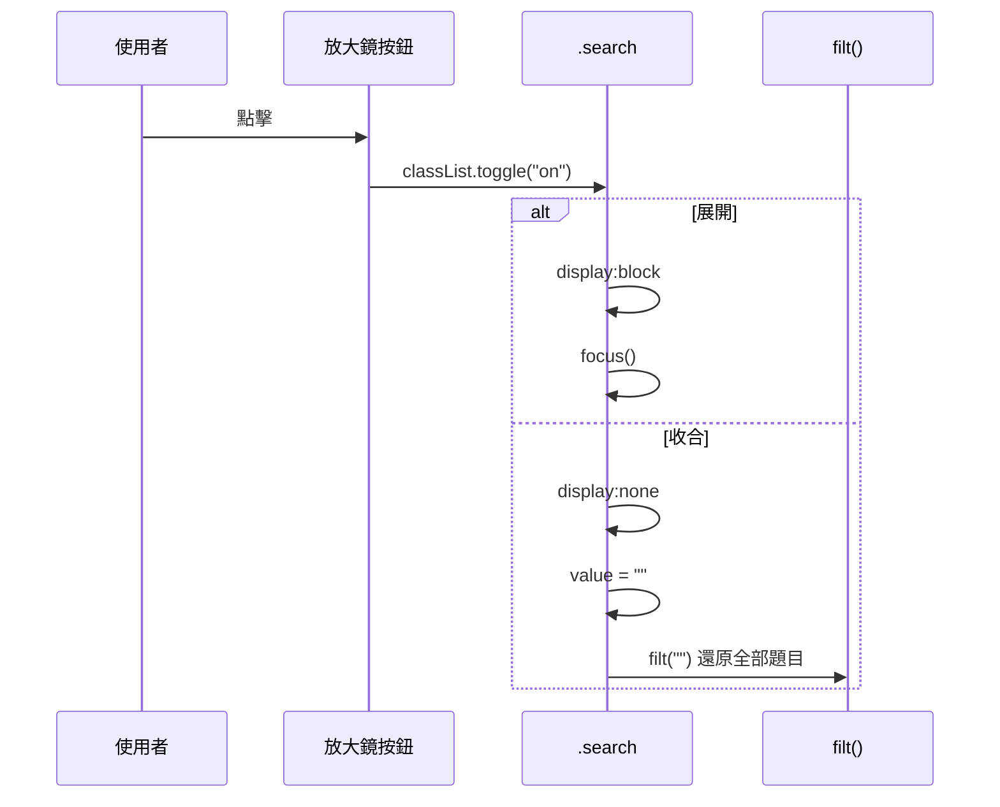

收合時會清空搜尋字並呼叫 `filt("")`，避免題目還被篩選卻看不到搜尋框。