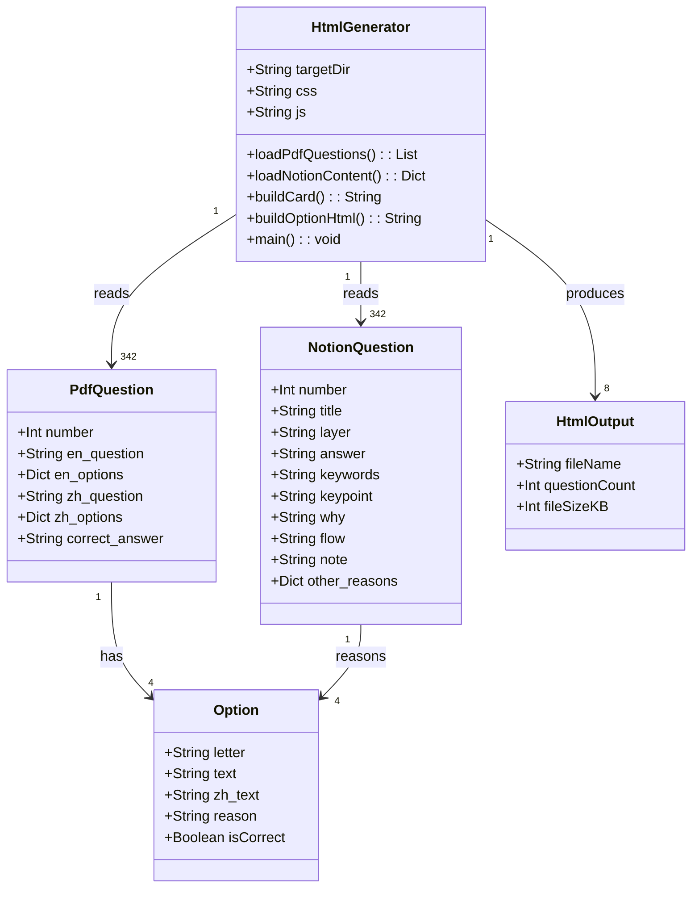
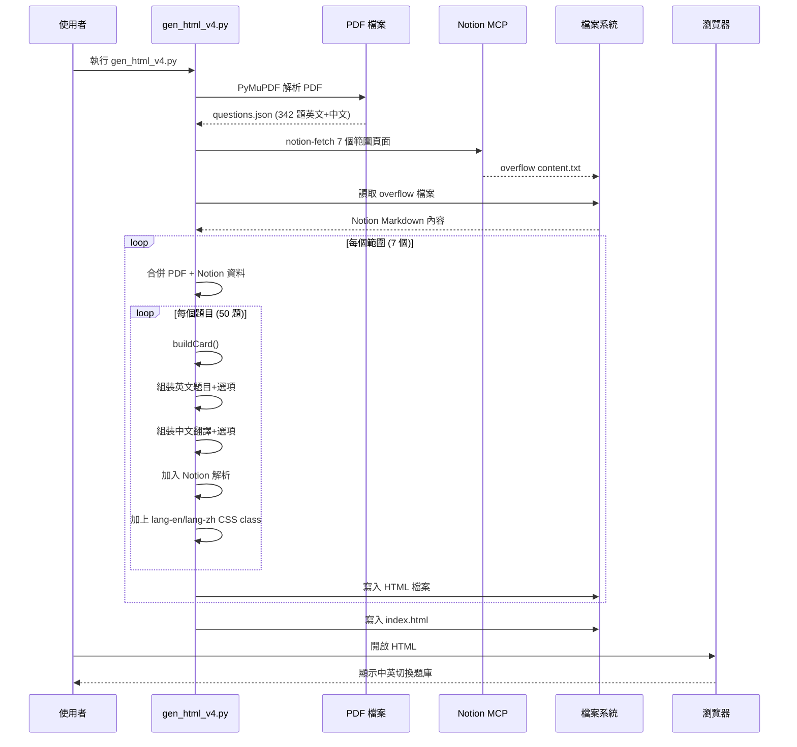
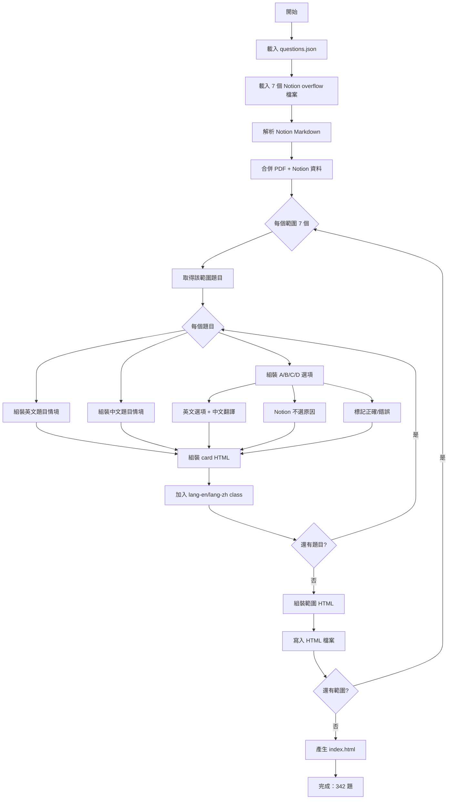
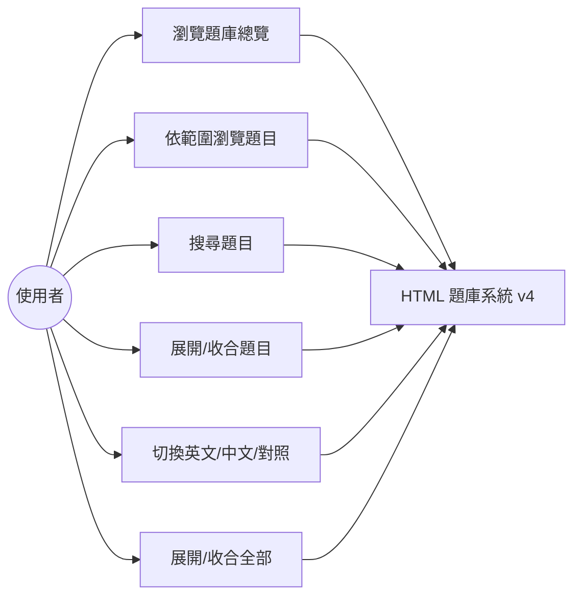
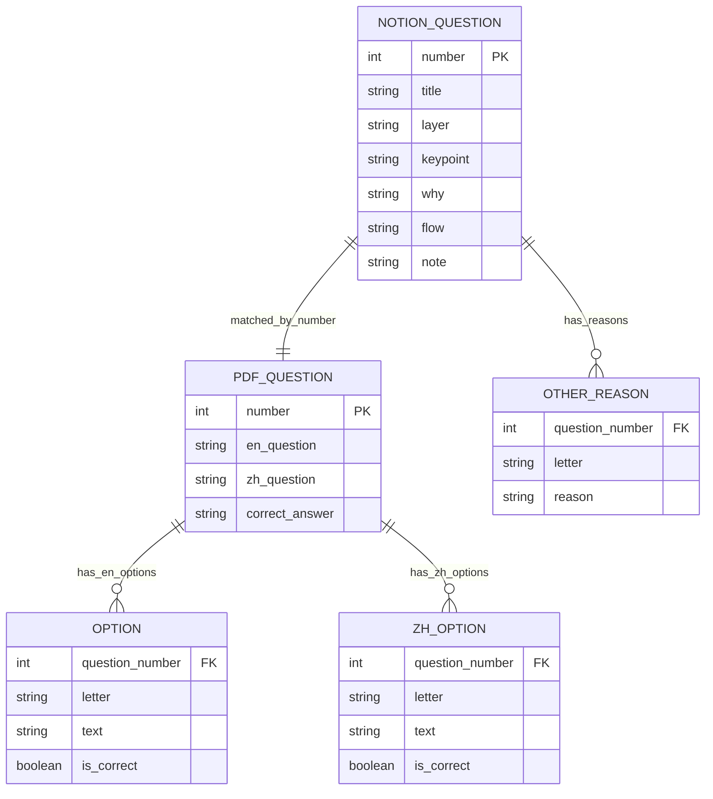
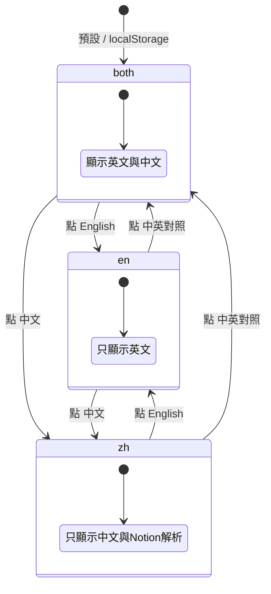

# AWS DEA-C01 HTML 產生器 v4 - Mermaid 圖表

> 產生日期：2026-08-06
> 結合 PDF 英文原文 + Notion 中文解析，產生含中英切換的 HTML

## 類別圖（Class Diagram）



## 循序圖（Sequence Diagram）



## 流程圖（Flowchart）



## UseCase 圖



## 資料結構 ER Model



## 語言切換機制

`body` 的 class 決定顯示哪一種語言，內容元素則掛 `lang-en` / `lang-zh`。

> **重要**：body 的 class 必須用 `mode-*` 前綴，不能與內容的 `lang-*` 同名。
> 若 body 也叫 `lang-en`，`.lang-en{display:none}` 會直接把整個 body 隱藏，造成全白畫面。



| body class | 顯示的內容 |
|------------|-----------|
| `mode-en` | `.lang-en`（英文題目、英文選項） |
| `mode-zh` | `.lang-zh`（中文題目、中文選項、不選原因、Notion 解析） |
| `mode-both` | 兩者皆顯示，中文以虛線分隔並淡化 |

對應 CSS：

```css
.lang-en,.lang-zh{display:none}
body.mode-en .lang-en{display:block}
body.mode-zh .lang-zh{display:block}
body.mode-both .lang-en,body.mode-both .lang-zh{display:block}
```

語言偏好以 `localStorage.dea-lang` 記憶，下次開啟自動套用。