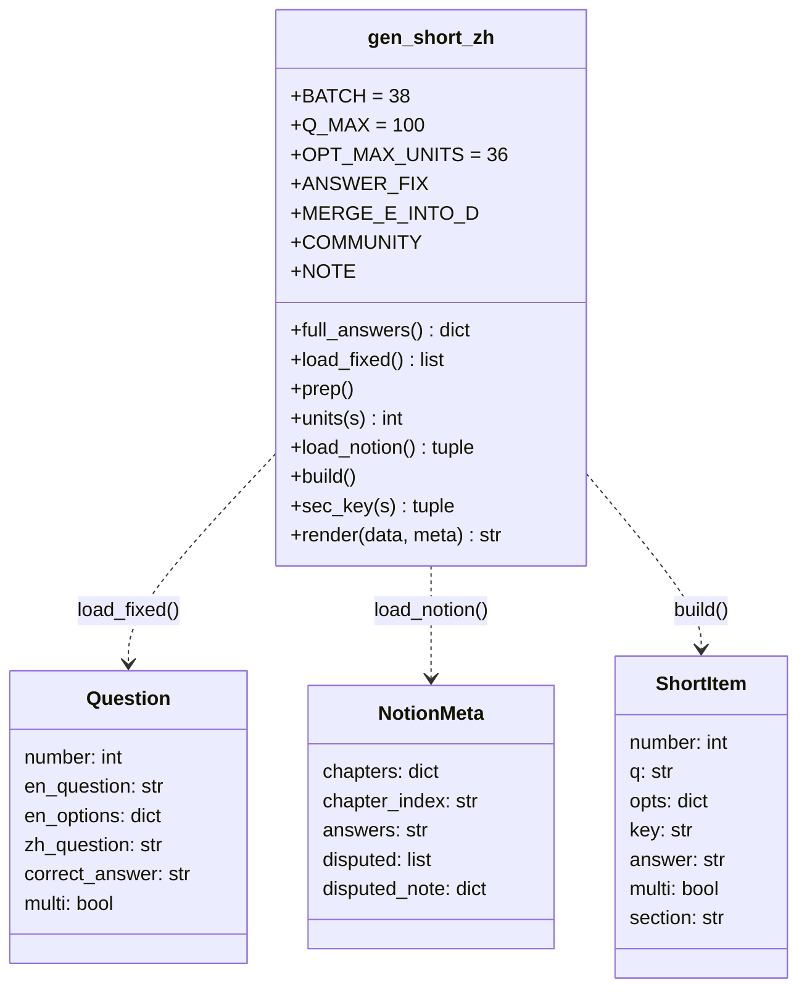
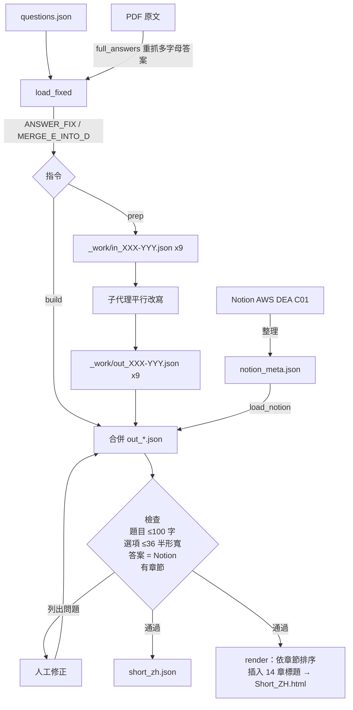
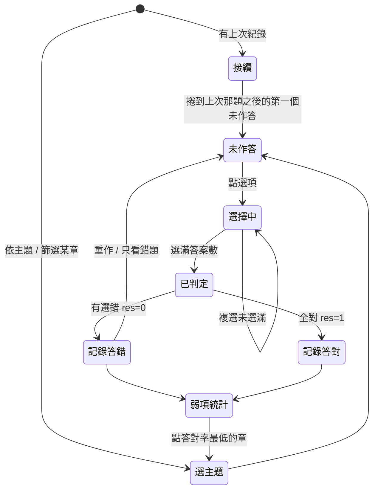
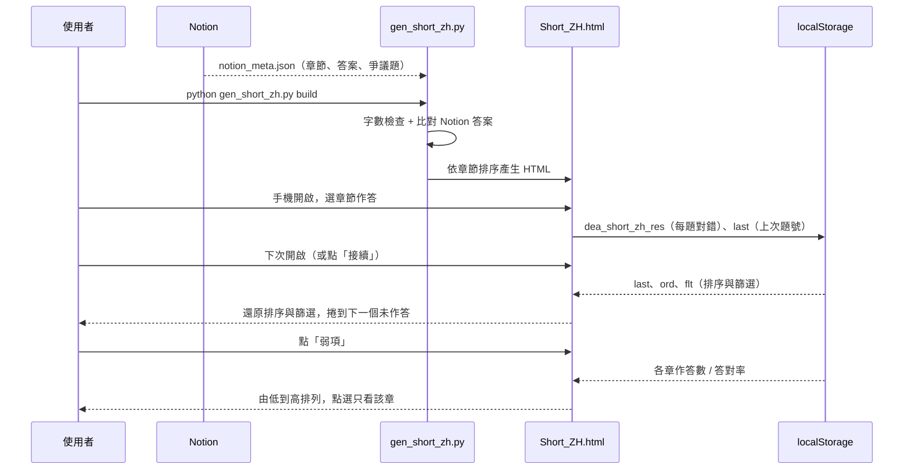
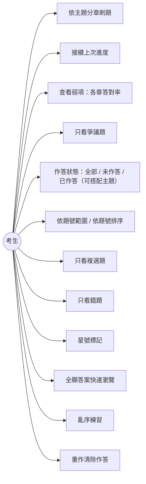
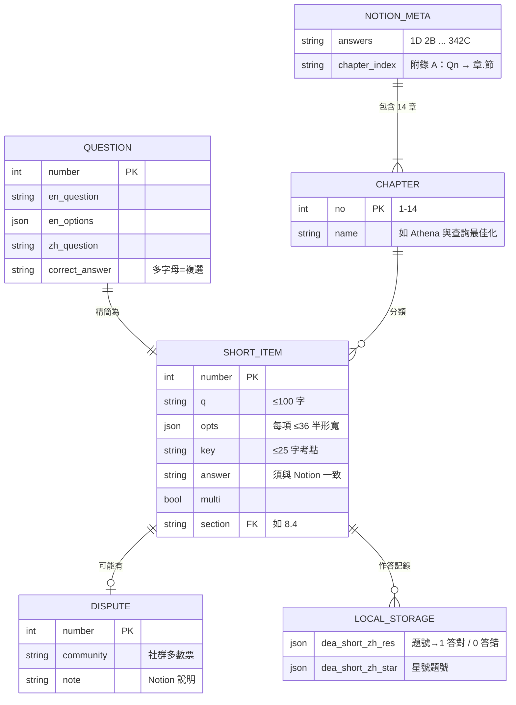

# gen_short_zh.py - Mermaid 圖表

> 產生日期：2026-10-05｜DEA-C01 中文精簡版（手機快速複習）｜更新：依 Notion 14 章主題分類、弱項統計

## 類別圖（模組結構）

```mermaid
classDiagram
    class gen_short_zh {
        +BATCH = 38
        +Q_MAX = 100
        +OPT_MAX_UNITS = 36
        +ANSWER_FIX
        +MERGE_E_INTO_D
        +COMMUNITY
        +NOTE
        +full_answers() dict
        +load_fixed() list
        +prep()
        +units(s) int
        +load_notion() tuple
        +build()
        +sec_key(s) tuple
        +render(data, meta) str
    }
    class Question {
        number: int
        en_question: str
        en_options: dict
        zh_question: str
        correct_answer: str
        multi: bool
    }
    class ShortItem {
        number: int
        q: str
        opts: dict
        key: str
        answer: str
        multi: bool
        section: str
    }
    class NotionMeta {
        chapters: dict
        chapter_index: str
        answers: str
        disputed: list
        disputed_note: dict
    }
    gen_short_zh ..> Question : load_fixed()
    gen_short_zh ..> NotionMeta : load_notion()
    gen_short_zh ..> ShortItem : build()
```

## 流程圖

```mermaid
flowchart TD
    A[questions.json] --> B[load_fixed]
    P[PDF 原文] -->|full_answers 重抓多字母答案| B
    B -->|ANSWER_FIX / MERGE_E_INTO_D| C{指令}
    C -->|prep| D[_work/in_XXX-YYY.json x9]
    D --> E[子代理平行改寫]
    E --> F[_work/out_XXX-YYY.json x9]
    C -->|build| G[合併 out_*.json]
    F --> G
    N[Notion AWS DEA C01] -->|整理| M[notion_meta.json]
    M -->|load_notion| G
    G --> H{檢查<br>題目 ≤100 字<br>選項 ≤36 半形寬<br>答案 = Notion<br>有章節}
    H -->|列出問題| I[人工修正]
    I --> G
    H -->|通過| J[short_zh.json]
    H -->|通過| K[render：依章節排序<br>插入 14 章標題 → Short_ZH.html]
```

## 循環圖（手機作答）

```mermaid
stateDiagram-v2
    [*] --> 接續 : 有上次紀錄
    接續 --> 未作答 : 捲到上次那題之後的第一個未作答
    [*] --> 選主題 : 依主題 / 篩選某章
    選主題 --> 未作答
    未作答 --> 選擇中 : 點選項
    選擇中 --> 選擇中 : 複選未選滿
    選擇中 --> 已判定 : 選滿答案數
    已判定 --> 記錄答錯 : 有選錯 res=0
    已判定 --> 記錄答對 : 全對 res=1
    記錄答錯 --> 弱項統計
    記錄答對 --> 弱項統計
    弱項統計 --> 選主題 : 點答對率最低的章
    記錄答錯 --> 未作答 : 重作 / 只看錯題
```

## 循序圖

```mermaid
sequenceDiagram
    participant U as 使用者
    participant N as Notion
    participant S as gen_short_zh.py
    participant H as Short_ZH.html
    participant L as localStorage
    N-->>S: notion_meta.json（章節、答案、爭議題）
    U->>S: python gen_short_zh.py build
    S->>S: 字數檢查 + 比對 Notion 答案
    S->>H: 依章節排序產生 HTML
    U->>H: 手機開啟，選章節作答
    H->>L: dea_short_zh_res（每題對錯）、last（上次題號）
    U->>H: 下次開啟（或點「接續」）
    L-->>H: last、ord、flt（排序與篩選）
    H-->>U: 還原排序與篩選，捲到下一個未作答
    U->>H: 點「弱項」
    L-->>H: 各章作答數 / 答對率
    H-->>U: 由低到高排列，點選只看該章
```

## UseCase

```mermaid
flowchart LR
    U((考生))
    U --> UC0[依主題分章刷題]
    U --> UC11[接續上次進度]
    U --> UC8[查看弱項：各章答對率]
    U --> UC9[只看爭議題]
    U --> UC10[作答狀態：全部 / 未作答 / 已作答（可搭配主題）]
    U --> UC1[依題號範圍 / 依題號排序]
    U --> UC2[只看複選題]
    U --> UC3[只看錯題]
    U --> UC4[星號標記]
    U --> UC5[全顯答案快速瀏覽]
    U --> UC6[亂序練習]
    U --> UC7[重作清除作答]
```

## Data Dictionary / ER Model

```mermaid
erDiagram
    QUESTION ||--|| SHORT_ITEM : "精簡為"
    CHAPTER ||--o{ SHORT_ITEM : "分類"
    NOTION_META ||--|{ CHAPTER : "包含 14 章"
    SHORT_ITEM ||--o| DISPUTE : "可能有"
    QUESTION {
        int number PK
        string en_question
        json en_options
        string zh_question
        string correct_answer "多字母=複選"
    }
    SHORT_ITEM {
        int number PK
        string q "≤100 字"
        json opts "每項 ≤36 半形寬"
        string key "≤25 字考點"
        string answer "須與 Notion 一致"
        bool multi
        string section FK "如 8.4"
    }
    CHAPTER {
        int no PK "1-14"
        string name "如 Athena 與查詢最佳化"
    }
    NOTION_META {
        string answers "1D 2B ... 342C"
        string chapter_index "附錄 A：Qn → 章.節"
    }
    DISPUTE {
        int number PK
        string community "社群多數票"
        string note "Notion 說明"
    }
    LOCAL_STORAGE {
        json dea_short_zh_res "題號→1 答對 / 0 答錯"
        json dea_short_zh_star "星號題號"
    }
    SHORT_ITEM ||--o{ LOCAL_STORAGE : "作答記錄"
```
