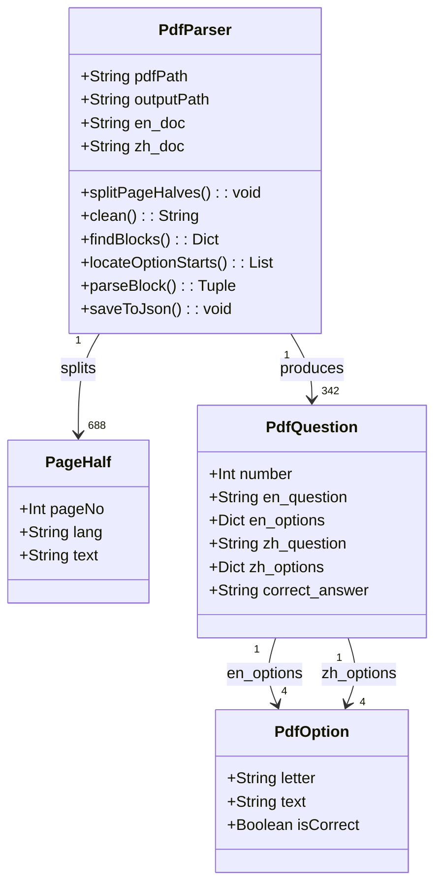
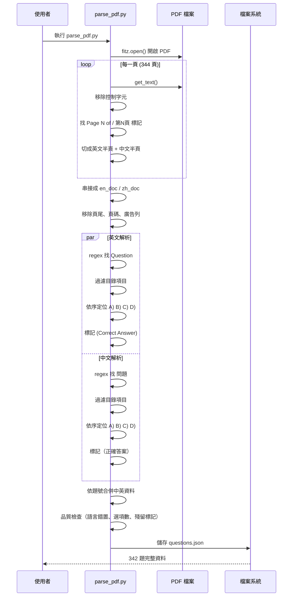
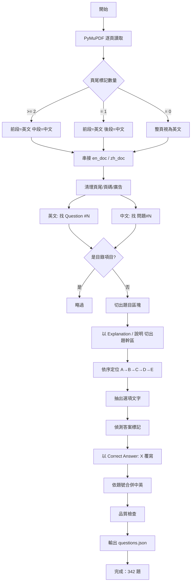
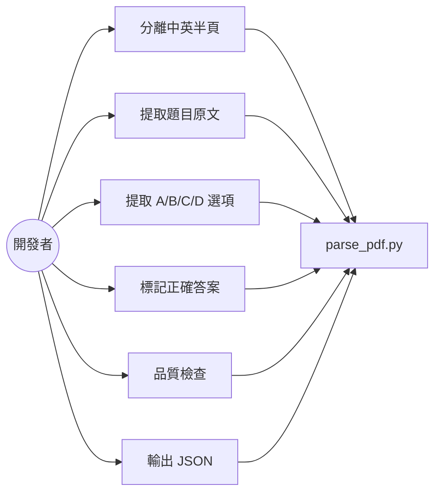
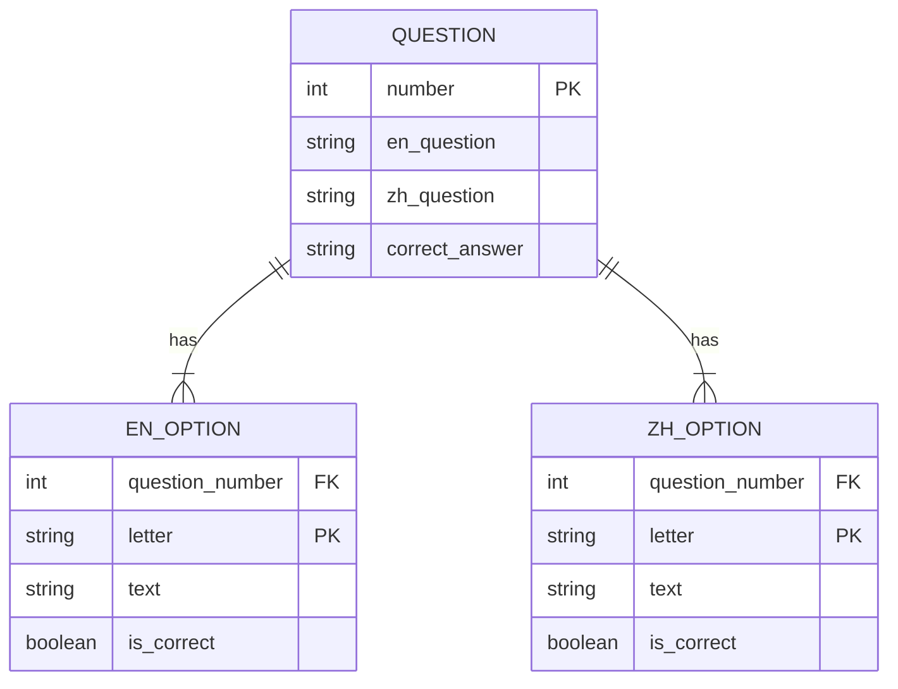

# AWS DEA-C01 PDF 解析器 - Mermaid 圖表

> 產生日期：2026-08-06
> 解析中英對照 PDF，分離英文半頁與中文半頁後提取題目原文與選項

## 解析策略

PDF 每一頁的版面為「上半英文、下半中文」，兩半各自以頁尾標記結尾：

| 半頁 | 頁尾標記 |
|------|----------|
| 英文 | `Page N of 344` |
| 中文 | `Page N of 344` 或 `第N頁，共344頁` |

若直接把整份 PDF 串成一份文字解析，跨頁題目會出現「英文-中文-英文-中文」交錯，導致區塊切割錯亂。
因此先依頁尾標記把每頁拆成兩半，分別串接成 `en_doc` 與 `zh_doc`，再各自解析。

## 類別圖（Class Diagram）

## 循序圖（Sequence Diagram）

## 流程圖（Flowchart）

## UseCase 圖

## 資料結構 ER Model

## 解析結果

| 檢查項目 | 結果 |
|----------|------|
| 總題數 | 342 |
| 英文題目 | 342 |
| 中文題目 | 342 |
| 正確答案 | 342 |
| 英文題目誤含中文 | 0 |
| 中文題目誤含英文 | 0 |
| 英文選項誤含中文 | 0 |
| 選項數不足 4 個 | 0 |
| 殘留答案標記 | 0 |
| 選項為空 | 1（Q323，PDF 中選項為 SQL 圖片） |